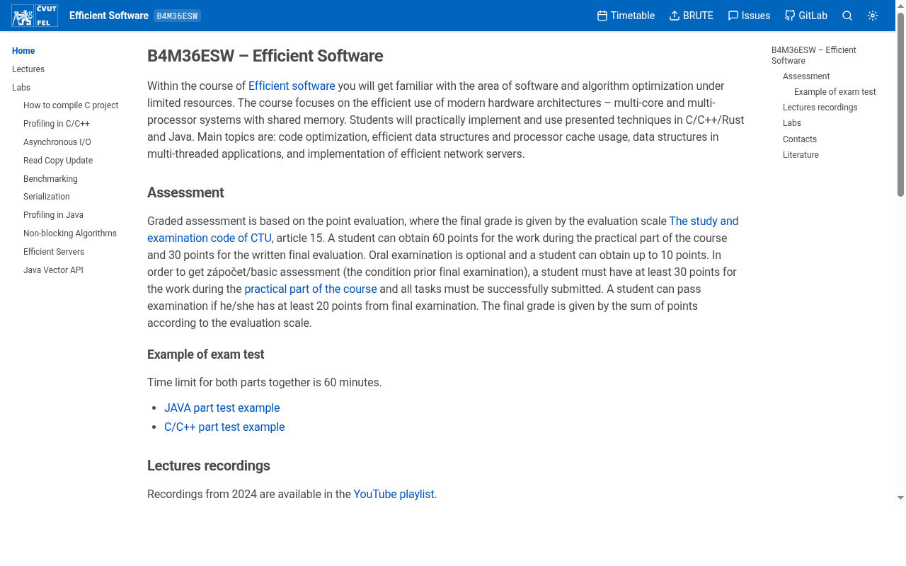

# Course Page (Zola theme)

A Zola theme for course websites at the [Faculty of Electrical Engineering, Czech Technical University in Prague (FEE CTU)](https://fel.cvut.cz/en), featuring sidebar navigation and table of contents.



- [https://esw.pages.fel.cvut.cz](https://esw.pages.fel.cvut.cz)
- [https://psy.pages.fel.cvut.cz](https://psy.pages.fel.cvut.cz)

## Requirements

- Zola 0.19.0 or later

## Usage

1. Add theme to your site (as git submodule or copy):

   ```bash
   git submodule add https://github.com/jdupak/zola-course-page.git themes/course-page
   ```

2. Enable in `config.toml`:

   ```toml
   theme = "course-page"
   compile_sass = true

   # Required when using course_search = true
   build_search_index = true
   ```

3. Configure in `config.toml`:

   ```toml
   [extra]
   subject_name = "..."
   subject_code = "..."

   timetable_link = "https://..."
   gitlab_link = "https://..."
   forum_link = "https://..."
   
   course_repo = "https://gitlab.fel.cvut.cz/..."
   course_edit_path = "-/edit/main/content"

   course_search = true
   course_theme = "auto"  # "light", "dark", or "auto"
   course_katex = true     # load KaTeX for math rendering (default: false)
   ```

### Theme selection precedence

The final theme is chosen in this order:

1. **User preference** saved by the theme toggle (stored in `localStorage` as `theme`).
2. **Site default** from `config.extra.course_theme` (`"light"`, `"dark"`, `"auto"`).
3. **System preference** (`prefers-color-scheme`) when `course_theme = "auto"` and there is no user preference.

See `examples/config.toml` for all available options.

## Directory Structure

- `theme.toml` — Theme metadata and default configuration
- `templates/` — Tera templates (base layout, partials, macros, shortcodes)
- `sass/` — SCSS stylesheets (compiled by Zola)
  - `course-page.scss` — Main entry point
  - `_variables.scss` — Design tokens, mixins
  - `_theme.scss` — Light/dark CSS custom properties
  - `_reset.scss` — Minimal browser reset
  - `_base.scss` — Layout grid, responsive breakpoints
  - `_markdown.scss` — Content typography
  - `_shortcodes.scss` — Shortcode styles (hint)
  - `_search_modal.scss` — Search dialog
  - `components/` — Topbar, sidebar, code blocks, theme toggle
- `static/` — JavaScript, fonts, syntax themes
- `scripts/` — Build helpers (archive directory processing)
- `examples/` — Example configuration

## Customization

Override any template by creating the same path in your site root. For example, to customize the top bar, copy `themes/course-page/templates/partials/topbar.html` to `templates/partials/topbar.html` and edit.

## Features

- Sidebar navigation with collapsible sections (up to 3 nesting levels)
- Table of contents generation
- Full-text search (Elasticlunr.js, opt-in via `course_search`)
- KaTeX math rendering (opt-in via `course_katex`)
- Light/dark theme toggle (auto / light / dark, persisted in localStorage)
- Code syntax highlighting with copy buttons
- Responsive mobile layout with slide-in sidebars
- Edit page / feedback links via repository integration
- Archive directory support (`.zip/`, `.tar.gz/`, `.tgz/` directories in `content/` are packed into real archives at build time)

## Page Frontmatter

Pages and sections support these options under `[extra]`:

| Key                        | Type | Default | Description                          |
|----------------------------|------|---------|--------------------------------------|
| `course_toc`               | bool | `true`  | Show/hide table of contents          |
| `course_hidden`            | bool | `false` | Hide page/section from sidebar menu  |
| `course_collapse_section`  | bool | `false` | Make section collapsible in sidebar   |

## License

MIT License - see [LICENSE](LICENSE).

Copyright (c) 2026 Jakub Dupak <dev@jakubdupak.com>

Based on the MIT licensed [Hugo Book theme](https://github.com/alex-shpak/hugo-book) by Alex Shpak.  
Visual design inspired by [CTU FEL CourseWare Wiki](https://cw.fel.cvut.cz/wiki/).
